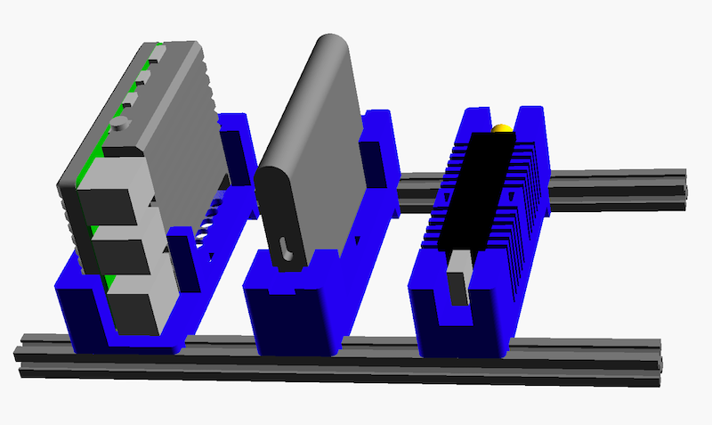

# 3D Models for Raspberry Pi Racks

The rack is build from two supporting maker beams (10mm x 10mm).
There are holders for different modules I use for Raspberry Pi setups:

* Raspberry Pi with passive cooling Armor case
* External Samsung SSD
* Nooelec NESDR SMArt

These components are placed into the holders and fixed with a cable strap.